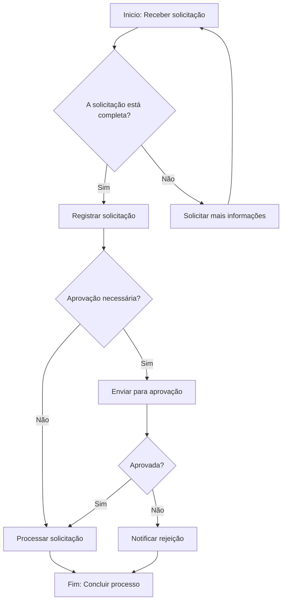

# Aninha Eu te amo!

Essa é minha documentação

```mermaid
graph TD
    A[Inicio: Receber solicitação] --> B{A solicitação está completa?}
    B -- Sim --> C[Registrar solicitação]
    B -- Não --> D[Solicitar mais informações]
    D --> A
    C --> E{Aprovação necessária?}
    E -- Sim --> F[Enviar para aprovação]
    E -- Não --> G[Processar solicitação]
    F --> H{Aprovada?}
    H -- Sim --> G
    H -- Não --> I[Notificar rejeição]
    G --> J[Fim: Concluir processo]
    I --> J

```