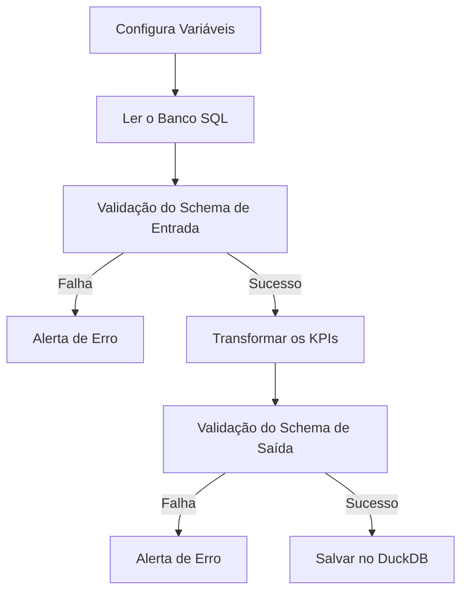

# Projeto Data Quality

Para desenvolver o desafio de negócio, a montagem da ETL foi feita conforme abaixo:

## Fluxo

```mermaid
graph TD;
    A[Configura Variáveis] --> B[Ler o Banco SQL];
    B --> V[Validação do Schema de Entrada];
    V -->|Falha| X[Alerta de Erro];
    V -->|Sucesso| C[Transformar os KPIs];
    C --> Y[Validação do Schema de Saída];
    Y -->|Falha| Z[Alerta de Erro];
    Y -->|Sucesso| D[Salvar no DuckDB];

```

## Contrato de dados

::: app.schema.ProdutoSchema